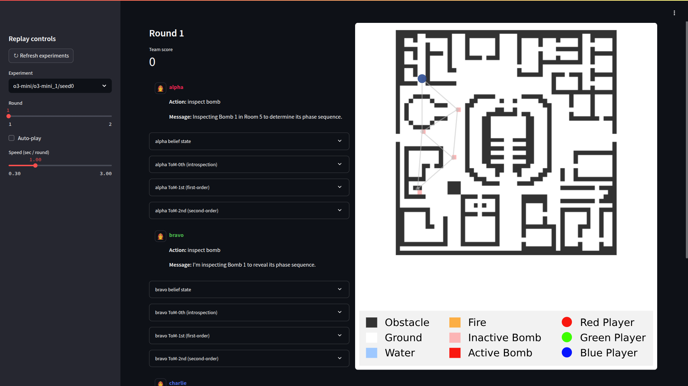

# ToM-App

A graphical user interface (GUI) for visualizing the `gym-dragon` environment from generated logs.



## Setup

1. **Configure Data Folder**

    Edit `utils.py` and set the data folder path:
    ```python
    ROOT_DATA = Path("../LLM_MARL/data")
    ```

2. **Run the Application**

    Launch the Streamlit app:
    ```bash
    streamlit run app.py
    ```

## Requirements

- Python 3.7+
- [Streamlit](https://streamlit.io/)
- Dependencies listed in `requirements.txt`

## License

MIT. See [LICENSE](LICENSE) for details.