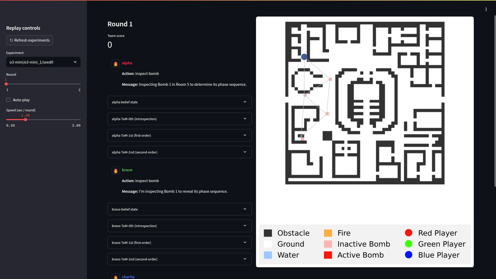

# ToM-App

A graphical user interface (GUI) for visualizing the `gym-dragon` environment from generated logs.



## Setup

1. **Install dependencies**

    ```bash
    pip install -r requirements.txt
    ```

2. **Run the Application**

    ```bash
    streamlit run app.py
    ```

By default the app looks for `sample_data/` first, then `data/`. To point at a
local experiment folder explicitly:

```bash
export TOM_APP_DATA_SOURCE=local
export TOM_APP_DATA_ROOT=/usr/users/xai/gama_hei/projects/LLM_MARL/data
streamlit run app.py
```

## Cloud data

The dashboard can read full experiment logs and renders from Google Cloud
Storage while keeping only code and a small `sample_data/` directory in Git.

Recommended bucket layout:

```text
gs://<bucket>/<prefix>/
  experiments/<model>/<experiment>/seed<seed>/
    args.json
    results.json
    summary.csv
    record.jsonl
    chat_log.jsonl
    renders/round_*.svg
    renders/round_*.pdf
  metadata/runs.jsonl
  metadata/runs.csv
```

Build a local metadata index:

```bash
python scripts/build_index.py \
  --output-dir metadata
```

Upload full artifacts and the metadata index:

```bash
python scripts/sync_to_gcs.py
```

Configure Render:

```bash
TOM_APP_DATA_SOURCE=auto
GCS_BUCKET_NAME=YOUR_BUCKET
TOM_APP_GCS_PREFIX=tom-app
GCP_PROJECT_ID=YOUR_PROJECT_ID
GOOGLE_APPLICATION_CREDENTIALS=/etc/secrets/gcp-service-account.json
```

Alternatively, paste the service-account JSON into
`GOOGLE_APPLICATION_CREDENTIALS_JSON`. The Render runtime only needs read
access to the bucket objects; the machine that uploads experiment data needs
write access.

For local development, copy `.env.example` to `.env` and replace
`GCS_BUCKET_NAME`. `TOM_APP_DATA_ROOT` should point to the experiment-runner
repository's data folder, for example
`/usr/users/xai/gama_hei/projects/LLM_MARL/data`. `.env` is ignored by Git and
is loaded automatically by the dashboard and helper scripts.

If Cloud Storage is unavailable, the app falls back to local sample data.
Create that sample set with:

```bash
python scripts/make_sample_data.py \
  --dest sample_data \
  --models 3 \
  --seeds 3 \
  --max-renders-per-run 4
```

After `sample_data/` is committed and the full archive is uploaded, remove the
large tracked data from Git history going forward with a normal index-only
removal:

```bash
git rm -r --cached data
```

## Requirements

- Python 3.10+
- [Streamlit](https://streamlit.io/)
- Dependencies listed in `requirements.txt`

## License

MIT. See [LICENSE](LICENSE) for details.
